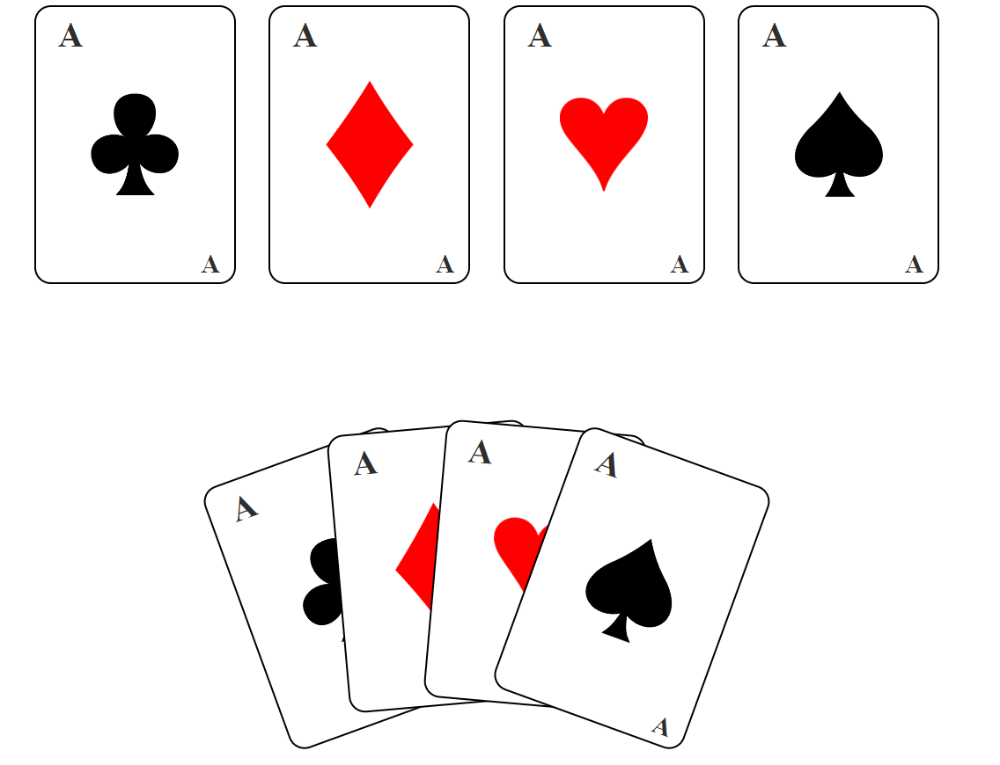

# Frontend Mentor - 3-column preview card component solution



## Welcome! 
Thank you for checking out my project!

## Table of contents
- [The challenge](#the-challenge)
- [Built with](#built-with)
- [What I learned](#what-i-learned)
- [Continued development](#continued-development)
- [Author](#author)


### The challenge

Create a set of cards - choosing from one of the poker hands.

Add a hover effect, so when you hover over each card, the card pops out.
You can use my example code with the boxes to start with. But try to be creative and come up with your own effect (using transform).

### Built with

- Semantic HTML5 markup
- CSS custom properties
- Flexbox
- Mobile-first workflow

### What I learned

```css
.card {
    transition: transform linear 0.4s, opacity linear 0.4s;
    cursor: pointer;
}

.club1 {
    transform:translateX(150px) rotate(-20deg);
    
}

.club1:hover {
    transform:translateY(-200px) translateX(150px) rotate(-5deg);
}
```

### Continued development
In the future may be added responsiveness to more sizes of screens. 

## Author

-LinkedIn [Cristina Baiu (FineLine0)](https://www.linkedin.com/in/cristinabaiu01/)
-GitHub [Cristina Baiu (FineLine0)](https://github.com/FineLine01)
